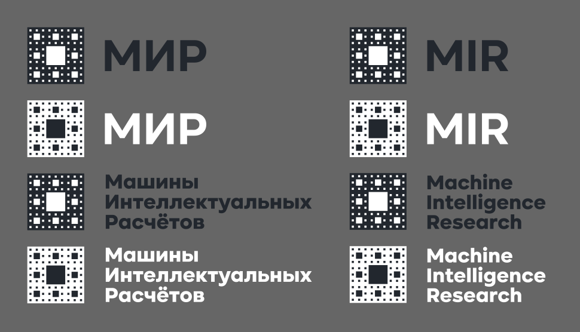

# Брендинг МИР

## Имя

В официальных публикациях сокращенное название МИР всегда должно записываться заглавными буквами. Полное наименование Машины Интеллектуальных Расчётов.

## Логотип

Логотип МИР состоит из "Черного ящика" в виде темного квадрата и текста «МИР». Оба элемента всегда находятся в этом визуальном порядке; значок, затем текст.

Текст в этом логотипе записан шрифтом «Inter», который можно найти на [Google Fonts](https://fonts.google.com/specimen/Inter). Эти шрифты находятся под лицензией Open Font License.

## Полное наименование

Полный вариант логотипа представляет собой "Черный ящик" в виде темного квадрата, слева от текста Машины Интеллектуальных Расчётов.

Этот логотип доступен в двух цветовых и языковых решениях в зависимости от вариантов использования:

* Русский язык, полное наименование - Машины Интеллектуальных Расчётов;
* Русский язык, сокращенное наименование - МИР;
* Английский язык, полное наименование - Machine Intelligence Research;
* Английский язык, сокращенное наименование - MIR;

Цвет:
* Белый #ffffff
* Темный #22272e

### Темный на белом

* Вариант с полным наименованием логотипа Machine Intelligence Research - темный квадрат слева от текста темного цвета Machine Intelligence Research
* Вариант с полным наименованием логотипа Машины Интеллектуальных Расчётов - темный квадрат слева от темного текста Машины Интеллектуальных Расчётов

### Белый на темном

* Вариант с полным наименованием логотипа Machine Intelligence Research - белый квадрат слева от текста белого цвета Machine Intelligence Research"
* Вариант с полным наименованием логотипа Машины Интеллектуальных Расчётов - белый квадрат слева от текста белого цвета Машины Интеллектуальных Расчётов

Цветовое решение «белое на темном сохраняет минималистичный дизайн и подходит для использования на темном фоне.

Избегайте сочетания темного квадрата с текстом белого цвета.

## Сокращенное наименование

Вариант с сокращенным наименованием логотипа представляет собой темный квадрат слева от текста «МИР».

### Темный на белом

* Вариант с сокращенным наименованием логотипа MIR - темный квадрат слева от текста темного цвета MIR
* Вариант с сокращенным наименованием логотипа МИР - темный квадрат слева от текста темного цвета МИР

### Белый на темном

* Вариант с сокращенным наименованием логотипа MIR - белый квадрат слева от текста белого цвета MIR
* Вариант с сокращенным наименованием логотипа МИР - белый квадрат слева от текста белого цвета МИР

## Иконка

Иконка в виде темного квадрата представляет собой безграничную сложность: у иконки нет низа и верха, во все стороны. Искусственный интеллект становится все сложнее, однако его системы представляют собой «черный ящик». Это значит, что конечные пользователи не понимают принцип их работы.

* "Черный ящик"
* ИИ
* Иконка в виде темного квадрата